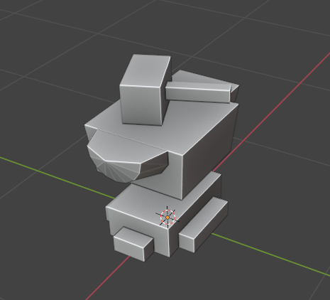

# CC-Model-Converter
Program to convert between Cubic Castles .modl files and .obj files

Cubic Castles: https://cubiccastles.com/  
Link to the forum post: https://forums2.cubiccastles.com/index.php?p=/discussion/32381/cc-modl-converter/  

## .modl file format:
```
(24 bytes) bounding box: (floats)
	(4 bytes)	x_min
	(4 bytes)	y_min
	(4 bytes)	z_min
	(4 bytes)	x_max
	(4 bytes)	y_max
	(4 bytes)	z_max
(1  byte ) delimiting 0
(4  bytes) number of vertices (int)
Loop through vertices:
(24 bytes) vertex: (all vertex values are 4 bytes (float))
	(4 bytes)	x		
	(4 bytes)	y		
	(4 bytes)	z		
	(4 bytes)	diffuse	(usually 0xffffffff)
	(4 bytes)	u		
	(4 bytes)	v		
(4  bytes ) number of indices (3 * num_triangles)
Loop through indices:
(6  bytes ) index: (each value is 2 bytes (short)) (indexes tell cc what vertices to use to create triangles)
	(2 bytes)	v1
	(2 bytes)	v2
	(2 bytes)	v3
(8 bytes) zero.. i dunno, looks like theres an 8 byte delimiter at the end thats always filled with 0
```

## Example of a model that has been imported into CC:  
  
  
  
## Example of a model that has been exported from CC:  
  
  
